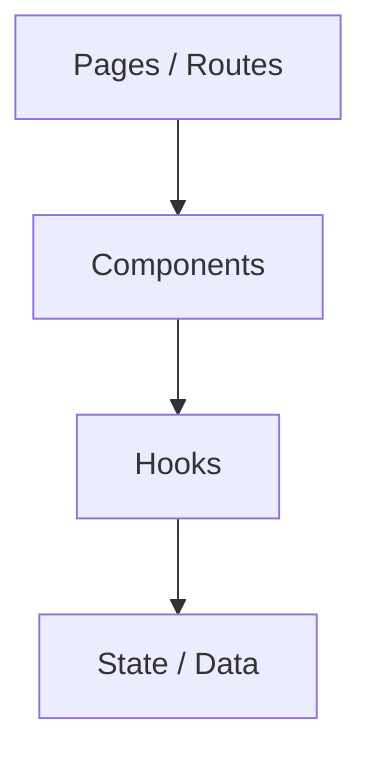

# React — High-Level Architecture

> TODO: fill in a reference architecture for a typical React project.

```mermaid
flowchart TD
    %% TODO: sketch the high-level architecture
    A[Pages / Routes] --> B[Components]
    B --> C[Hooks]
    C --> D[State / Data]
```
