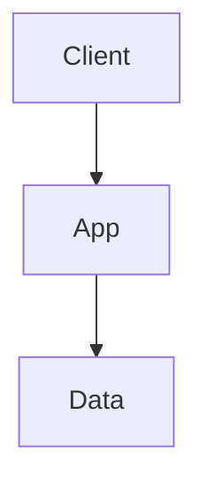

# JavaScript / TypeScript — High-Level Architecture

> TODO: fill in a reference architecture for a typical JS/TS project.

```mermaid
flowchart TD
    %% TODO: sketch the high-level architecture
    A[Client] --> B[App]
    B --> C[Data]
```
